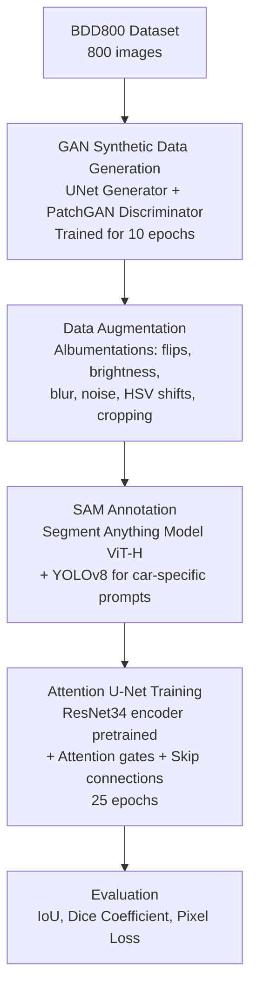
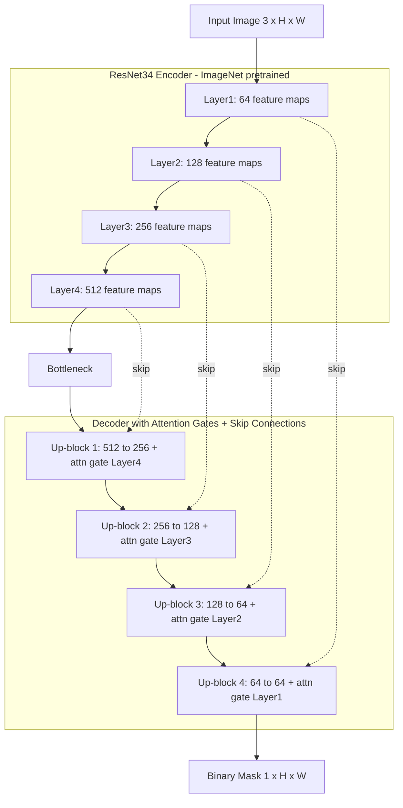

# 🚗 Car Instance Segmentation with Attention U-Net & SAM

> A deep learning pipeline for precise vehicle segmentation — combining GAN-based synthetic data augmentation, SAM-powered annotation, and an Attention U-Net with a ResNet34 backbone.

---

## 📋 Table of Contents

- [Overview](#overview)
- [Pipeline Architecture](#pipeline-architecture)
- [Dataset](#dataset)
- [Annotation with SAM](#annotation-with-sam)
- [Model Architecture](#model-architecture)
- [Data Augmentation](#data-augmentation)
- [Training](#training)
- [Results](#results)
- [Specialization: COCO Class 2](#specialization-coco-class-2)
- [Dependencies](#dependencies)
- [Notebook Structure](#notebook-structure)

---

## Overview

This project implements an end-to-end car segmentation system trained on a curated subset of the **Berkeley Deep Drive (BDD)** dataset. The pipeline addresses the challenge of limited labeled data by:

1. **Generating synthetic training images** using a custom GAN (U-Net Generator + PatchGAN Discriminator)
2. **Automating annotation** via the Segment Anything Model (SAM)
3. **Training an Attention U-Net** with a pretrained ResNet34 encoder for pixel-perfect car masks
4. **Evaluating** using industry-standard metrics: IoU, Dice Coefficient, and Pixel Accuracy

---

## Pipeline Architecture



---

## Dataset

The dataset is a curated **800-image subset** of the [Berkeley Deep Drive (BDD100K)](https://bdd-data.berkeley.edu/) dataset.

| Split      | Real Images | Synthetic Images | Total     |
|------------|-------------|-----------------|-----------|
| Training   | 500         | ~300            | ~1,500+   |
| Validation | 100         | —               | 100       |
| Test       | 200         | —               | 200       |

> **Synthetic Data Generation:** A GAN (U-Net generator + PatchGAN discriminator) was trained for 10 epochs on the BDD training set to generate ~300 additional synthetic images, which were then added to the training split. This helps improve model robustness and generalization.

---

## Annotation with SAM

Ground-truth segmentation masks were generated automatically using the **Segment Anything Model (SAM)** — specifically the `vit_h` (ViT-H) checkpoint — combined with **YOLOv8** for car-specific bounding box prompts.

**Why SAM?**
- ✅ Zero-shot segmentation without dataset-specific fine-tuning
- ✅ Prompt-based control for targeting only cars (COCO class 2)
- ✅ Pixel-perfect boundary quality ideal for training segmentation models
- ✅ Versatile across diverse driving scenes (urban, highway, low-light, etc.)

**Annotation Workflow:**
1. YOLOv8 detects car bounding boxes in each image
2. SAM receives bounding box prompts and generates high-quality masks
3. Masks are saved as binary segmentation ground-truth for downstream training

---

## Model Architecture

The segmentation model is an **Attention U-Net** built on a **pretrained ResNet34 encoder**.



**Key Components:**
| Component | Detail |
|---|---|
| Encoder | ResNet34 (ImageNet pretrained) |
| Attention | Channel & spatial attention gates on skip connections |
| Skip Connections | Preserve fine-grained spatial information |
| Output | Sigmoid activation → binary car mask |

---

## Data Augmentation

Data augmentation using the **Albumentations** library was applied during training to improve generalization.

| Augmentation | Parameters |
|---|---|
| Horizontal Flip | p = 0.5 |
| Random Brightness & Contrast | brightness_limit=0.2, contrast_limit=0.2, p=0.5 |
| Gaussian Blur | blur_limit=(3, 7), p=0.3 |
| Gaussian Noise | var_limit=(10, 50), p=0.3 |
| HSV Color Jitter | hue_shift_limit=20, sat_shift_limit=30, val_shift_limit=20, p=0.5 |
| Random Crop | Preserve aspect ratio, p=0.5 |

---

## Training

| Hyperparameter | Value |
|---|---|
| Epochs | 25 |
| Batch Size | 4 |
| Optimizer | Adam (lr=0.0002, β=(0.5, 0.999)) |
| Loss (GAN) | BCE Loss |
| Loss (Pixel-wise) | L1 Loss (λ=100) |
| Hardware | CUDA (GPU) |
| Checkpointing | Best validation loss model saved |

**Training Progress:**

| Epoch | Train Loss | Val Loss |
|---|---|---|
| 1  | 0.3096 | 0.3417 |
| 5  | 0.2341 | 0.2518 |
| 7  | 0.2030 | 0.2507 |
| 17 | 0.1504 | 0.2459 |
| 24 | 0.1389 | 0.2459 |
| 25 | 0.1256 | **0.2338** |

---

## Results

Final evaluation on the held-out **test set** (200 images):

| Metric | Score |
|---|---|
| **Dice Coefficient** | **0.5174** |
| **IoU (Intersection over Union)** | **0.4366** |
| **Pixel Loss** | **0.1506** |

> **Note:** The IoU and Dice values reflect the challenge of segmenting vehicles in complex real-world driving scenes with limited labeled data. The model is specifically optimized for standard passenger cars (COCO class 2).

---

## Specialization: COCO Class 2

The model is specifically optimized to detect and segment **COCO class 2 (car)** — standard passenger vehicles.

**Intentional Design Choices:**
- 🎯 Focused on a single, well-defined object class for higher task accuracy
- 🚌 Explicitly excludes buses, trucks, and motorcycles to avoid false positives
- 🎭 YOLOv8 class filtering during SAM annotation ensures clean, car-specific masks
- 📐 Precise boundary delineation suited for applications like autonomous driving perception, parking analysis, or traffic monitoring

---

## Dependencies

```
torch
torchvision
numpy
pandas
Pillow
opencv-python
albumentations
matplotlib
tqdm
segment-anything
ultralytics
```

**Pretrained Weights Required:**
- `sam_vit_h_4b8939.pth` — SAM ViT-H checkpoint ([Download](https://github.com/facebookresearch/segment-anything))
- `sam_vit_b_01ec64.pth` — SAM ViT-B checkpoint (optional, lighter alternative)

---

## Notebook Structure

| # | Section | Description |
|---|---|---|
| 1 | **Dataset Creation** | BDD800 subset setup: 500 train / 100 val / 200 test |
| 2 | **GAN Synthetic Data** | U-Net Generator + PatchGAN Discriminator training |
| 3 | **Real vs. Synthetic** | Comparison visualizations |
| 4 | **Data Augmentation** | Albumentations pipeline setup |
| 5 | **SAM Annotation** | Mask generation using SAM + YOLOv8 prompts |
| 6 | **Model Definition** | Attention U-Net architecture with ResNet34 encoder |
| 7 | **Training** | 25-epoch training loop with model checkpointing |
| 8 | **Testing & Evaluation** | IoU, Dice, Pixel Accuracy on test set |
| 9 | **Specialization** | COCO class 2 car-specific design rationale |

---

## Acknowledgements

- **Berkeley Deep Drive (BDD100K)** — Dataset source
- **Meta AI — Segment Anything Model (SAM)** — Zero-shot mask generation
- **Ultralytics YOLOv8** — Car detection for SAM prompting
- **Albumentations** — Data augmentation library

---

*Built with PyTorch on Kaggle GPU (CUDA). Notebook execution environment: Kaggle Kernel.*
